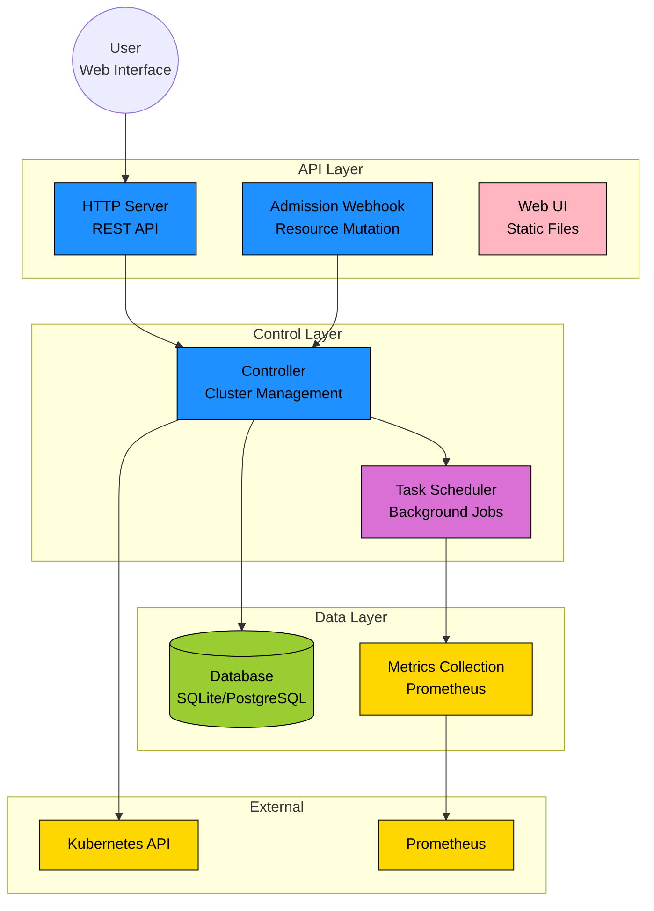

# CruiseKube

[](https://github.com/truefoundry/cruisekube)
[](https://golang.org/)
[](LICENSE)

**CruiseKube** is an intelligent Kubernetes resource optimization system that automatically manages and optimizes workload resources through real-time metrics analysis, predictive recommendations, and dynamic resource adjustments.

## 🚀 Features

- **Intelligent Resource Optimization**: Automatically analyzes workload patterns and applies resource recommendations
- **Multi-Cluster Support**: Manages resources across multiple Kubernetes clusters
- **Admission Webhook**: Dynamic pod resource mutation during deployment
- **Prometheus Integration**: Deep metrics collection and analysis for informed decisions
- **Web UI**: User-friendly interface for managing overrides and visualizing workload data
- **Flexible Deployment**: Supports local, in-cluster, and hybrid deployment modes
- **Database Persistence**: Stores workload stats and overrides (SQLite/PostgreSQL)
- **OpenTelemetry**: Built-in distributed tracing and observability
- **Node Load Monitoring**: Automatic node taint management based on load

## 🏗️ Architecture

CruiseKube consists of several key components:

### Core Components

- **Controller**: Manages cluster state, orchestrates tasks, and applies recommendations
- **Webhook**: Mutating admission webhook for dynamic resource adjustments
- **Frontend UI**: Web interface for override management and visualization
- **Metrics Collection**: Prometheus-based metrics gathering and analysis
- **Task Scheduler**: Executes background jobs (stats collection, recommendations, monitoring)
- **Database**: Persistent storage for workload data and configurations

### Architecture Diagram



## 📋 Prerequisites

- **Kubernetes**: v1.20+ cluster with admin access
- **Go**: v1.21+ for building from source
- **Prometheus**: Running in your cluster for metrics collection
- **Helm**: v3.0+ for chart-based deployment

## 🚀 Quick Start

### 1. Clone the Repository

```bash
git clone https://github.com/truefoundry/cruisekube.git
cd cruisekube
```

### 2. Build the Binary

```bash
go build -o cruisekube ./cmd/cruisekube
```

### 3. Configure CruiseKube

Copy and customize the configuration:

```bash
cp config.yaml my-config.yaml
# Edit my-config.yaml with your settings
```

### 4. Deploy with Helm

```bash
# Install the Helm chart
helm install cruisekube ./charts/cruisekube \
  --namespace cruisekube-system \
  --create-namespace \
  --values ./charts/cruisekube/values.yaml
```

### 5. Run Locally (Development)

```bash
# Local mode with external kubeconfig
./cruisekube --config-file-path=my-config.yaml \
  --execution-mode=both \
  --controller-mode=local \
  --kubeconfig-path=$HOME/.kube/config
```

## ⚙️ Configuration

CruiseKube uses a YAML configuration file with the following key sections:

### Basic Configuration

```yaml
# Execution mode: controller, webhook, or both
executionMode: both

# Controller mode: local or inCluster
controllerMode: local

# Dependencies
dependencies:
  local:
    kubeconfigPath: ""
    prometheusURL: "http://localhost:9090"
  inCluster:
    prometheusURL: ""

# Server settings
server:
  port: "8080"
  basicAuth:
    username: "admin"
    password: "admin"

# Webhook settings
webhook:
  port: "8443"
  certsDir: "/tmp/webhook-certs"
  dryRun: false

# Database configuration
db:
  type: sqlite  # or postgresql
  database: "stats-data/cruisekube.db"
```

### Task Configuration

```yaml
controller:
  tasks:
    createStats:
      enabled: true
      schedule: "15m"
    applyRecommendation:
      enabled: true
      schedule: "5m"
      metadata:
        dryRun: false
    nodeLoadMonitoring:
      enabled: true
      schedule: "60s"
    fetchMetrics:
      enabled: true
      schedule: "1m"
```

### Advanced Settings

```yaml
# Recommendation settings
recommendationSettings:
  newWorkloadThresholdHours: 1
  disableMemoryApplication: false
  maxConcurrentQueries: 30

# Telemetry (OpenTelemetry)
telemetry:
  enabled: true
  exporterOTLPEndpoint: "http://jaeger:14268/api/traces"
  serviceName: "cruisekube"
  traceRatio: 0.1
```

## 🎯 Deployment Modes

### 1. Local Development Mode

Run CruiseKube on your local machine, connecting to a remote cluster:

```bash
./cruisekube \
  --execution-mode=controller \
  --controller-mode=local \
  --kubeconfig-path=$HOME/.kube/config \
  --prometheus-url=http://prometheus.monitoring.svc.cluster.local:9090
```

### 2. In-Cluster Mode

Deploy CruiseKube directly in your Kubernetes cluster:

```bash
helm install cruisekube ./charts/cruisekube \
  --set controller.mode=inCluster \
  --set webhook.enabled=true
```

### 3. Hybrid Mode

Run controller locally and webhook in-cluster:

```bash
# Local controller
./cruisekube --execution-mode=controller --controller-mode=local

# In-cluster webhook
helm install cruisekube-webhook ./charts/cruisekube \
  --set controller.enabled=false \
  --set webhook.enabled=true
```

## 📊 API Endpoints

CruiseKube exposes several REST API endpoints:

### Core APIs

- `GET /api/v1/cluster/info` - Cluster information
- `GET /api/v1/workloads` - List workloads with stats
- `GET /api/v1/stats` - Workload statistics
- `POST /api/v1/overrides` - Create/update workload overrides
- `DELETE /api/v1/overrides/{namespace}/{name}` - Remove overrides

### Metrics & Health

- `GET /metrics` - Prometheus metrics
- `GET /health` - Health check
- `GET /ready` - Readiness probe

### Webhook

- `POST /mutate` - Admission webhook endpoint

## 🔧 Development

### Building from Source

```bash
# Install dependencies
go mod download

# Build binary
go build -o cruisekube ./cmd/cruisekube

# Run tests
go test ./...

# Build Docker image
docker build -t cruisekube:latest .
```

### Running Tests

```bash
# Unit tests
go test ./pkg/...

# Integration tests (requires running cluster)
go test ./test/integration/...

# Test with coverage
go test -cover ./...
```

### Local Development Setup

1. **Start local Prometheus** (if not available in cluster):
   ```bash
   docker run -p 9090:9090 prom/prometheus
   ```

2. **Configure local database**:
   ```bash
   mkdir -p stats-data
   # SQLite database will be created automatically
   ```

3. **Run CruiseKube**:
   ```bash
   ./cruisekube --config-file-path=config.yaml
   ```

4. **Access Web UI**:
   Open `http://localhost:8080` in your browser

## 🐛 Troubleshooting

### Common Issues

**1. Webhook Certificate Issues**
```bash
# Check webhook certificates
kubectl get mutatingwebhookconfiguration cruisekube-webhook -o yaml

# Regenerate certificates
kubectl delete secret cruisekube-webhook-certs -n cruisekube-system
helm upgrade cruisekube ./charts/cruisekube
```

**2. Database Connection Issues**
```bash
# Check database file permissions
ls -la stats-data/

# For PostgreSQL, verify connection
psql -h localhost -U username -d cruisekube
```

**3. Prometheus Connection Issues**
```bash
# Test Prometheus connectivity
curl http://prometheus-url:9090/api/v1/query?query=up

# Check service discovery
kubectl get svc -n monitoring
```

### Debug Mode

Enable debug logging:

```yaml
# In config.yaml
logging:
  level: debug
  format: json
```

Or via environment variable:
```bash
export LOG_LEVEL=debug
./cruisekube
```

## 📈 Monitoring

CruiseKube exposes Prometheus metrics for monitoring:

### Key Metrics

- `cruisekube_workloads_total` - Total workloads managed
- `cruisekube_recommendations_applied_total` - Applied recommendations
- `cruisekube_webhook_requests_total` - Webhook admission requests
- `cruisekube_task_execution_duration_seconds` - Task execution times
- `cruisekube_database_operations_total` - Database operation counts

### Grafana Dashboard

Import the provided Grafana dashboard:

```bash
kubectl apply -f grafana/cruisekube-metrics.json
```

## 🤝 Contributing

We welcome contributions! Please see our [Contributing Guidelines](CONTRIBUTING.md) for details.

### Development Workflow

1. Fork the repository
2. Create a feature branch: `git checkout -b feature/amazing-feature`
3. Make your changes and add tests
4. Run tests: `go test ./...`
5. Commit your changes: `git commit -m 'Add amazing feature'`
6. Push to the branch: `git push origin feature/amazing-feature`
7. Open a Pull Request

## 📄 License

This project is licensed under the Apache License 2.0 - see the [LICENSE](LICENSE) file for details.

## 🆘 Support

- **Issues**: [GitHub Issues](https://github.com/truefoundry/cruisekube/issues)
- **Discussions**: [GitHub Discussions](https://github.com/truefoundry/cruisekube/discussions)
- **Documentation**: [Wiki](https://github.com/truefoundry/cruisekube/wiki)

## 🙏 Acknowledgments

- Built with ❤️ by the TrueFoundry team
- Powered by Kubernetes, Prometheus, and Go
- Special thanks to all contributors and the open-source community
