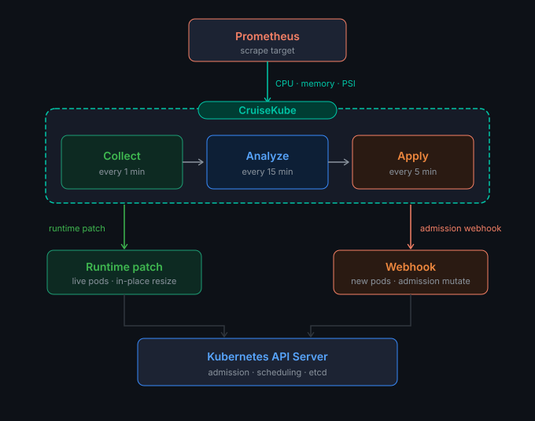
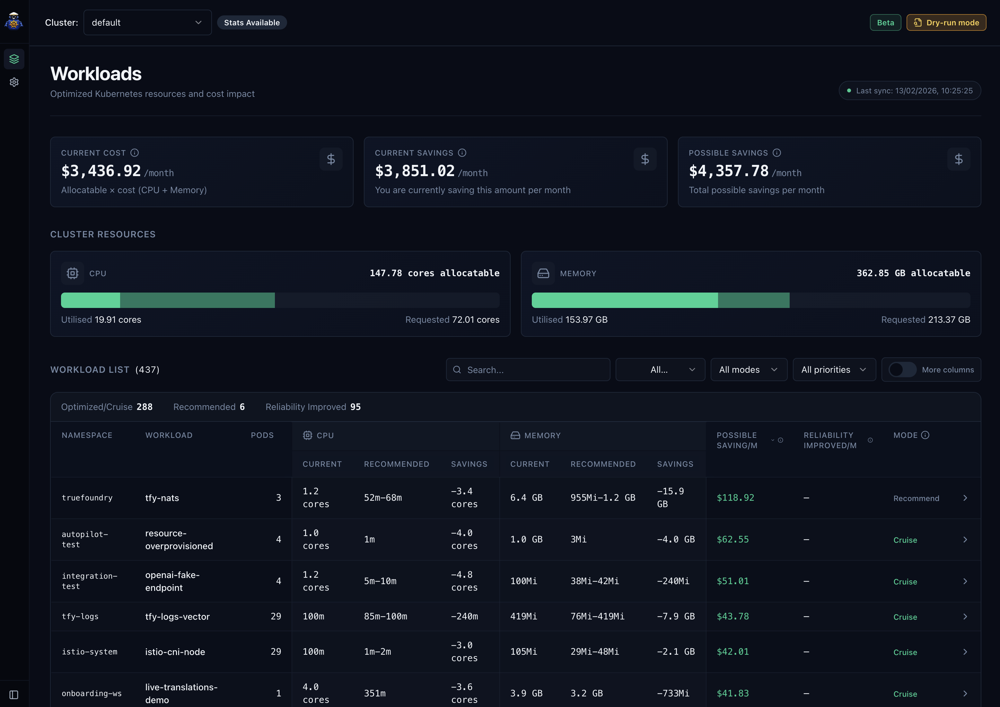

<div align="center">

<p align="center">
<a>
  
</a>
<a href="https://artifacthub.io/packages/helm/cruisekube/cruisekube">

</a>
 <a href="./LICENSE">
    
 </a>
 <a href="https://github.com/truefoundry/cruisekube/releases/latest">
    
 </a>
</p>
<h1>CruiseKube - Autopilot for Kubernetes</h1>
</div>

Stop guessing CPU and memory for your pods. CruiseKube watches what your workloads actually use and sets the right resource requests automatically — so you stop overpaying for idle capacity and stop getting paged for OOM kills.

## What is CruiseKube?

Every Kubernetes team sets CPU and memory requests too high because the cost of getting it wrong is a 3am page. The result: clusters run at 15-30% actual utilization while you pay for 100%.

**CruiseKube** fixes this by continuously observing your workloads through Prometheus and adjusting resource requests to match real usage — not guesswork, not one-time recommendations that go stale, but ongoing optimization that adapts as your workloads change.

It works two ways:

- **At runtime** — patches running pods with right-sized resources (Kubernetes 1.33+ in-place resize, no restarts needed)
- **At admission** — sets correct resources when pods start, via a mutating webhook, so new pods never launch with stale defaults

Install it, point it at Prometheus, and it starts working. No code changes, no annotations required.

## How is it different from VPA?

Kubernetes VPA recommends resource values. CruiseKube goes further:

- **Closed-loop** — doesn't just recommend, it applies. Continuously, not once.
- **Node-aware** — considers what else is running on the node before adjusting, so one pod's increase doesn't starve another.
- **Safe by default** — ships in observe mode (dry-run). You see recommendations first, switch to active when you're ready.
- **Disruption-aware** — respects PodDisruptionBudgets and configurable maintenance windows. Won't evict your pods during peak traffic.
- **OOM-reactive** — detects OOM kills and immediately increases memory, no manual intervention.

## When do you need CruiseKube?

- Your teams set `cpu: 2` and `memory: 4Gi` on every deployment because nobody knows the right number
- You've looked at cluster utilization dashboards and actual usage is a fraction of what's requested
- You've tried VPA but found the recommendations go stale, aren't applied automatically, or cause disruptive pod restarts
- Your devs don't want to think about resource tuning — they just want their apps to run

## How it works



1. **Collect** — Fetches CPU and memory metrics from Prometheus every minute
2. **Analyze** — Computes per-container recommendations using percentile analysis and time-series predictions every 15 minutes
3. **Apply** — Patches running pods in-place (K8s 1.33+) or evicts for right-sized restart. Webhook sets correct values for every new pod at admission time.

CruiseKube patches **pods, not deployments** — your git-managed manifests stay untouched. ArgoCD and Flux never see drift.

## Quick Start

**Prerequisites:** Kubernetes 1.33+, Helm, Prometheus running in your cluster

### Install

```bash
helm install cruisekube oci://tfy.jfrog.io/tfy-helm/cruisekube \
  --namespace cruisekube-system --create-namespace \
  --set cruisekubeController.env.CRUISEKUBE_DEPENDENCIES_INCLUSTER_PROMETHEUSURL="http://prometheus-kube-prometheus-prometheus.monitoring.svc:9090" \
  --set postgresql.enabled=true
```

### Verify

```bash
kubectl get pods -n cruisekube-system
```

### View recommendations

```bash
kubectl port-forward -n cruisekube-system svc/cruisekube-frontend 3000:3000
```

Open [http://localhost:3000](http://localhost:3000) to see recommendations for your workloads.



# Getting Started

Details on how to install and configure CruiseKube can be found in the [Getting Started](./docs/src/gs-installation.md) guide.

# Documentation

| Topic                          | Link                                                         |
|--------------------------------|--------------------------------------------------------------|
| Installation & Configuration   | [Setup Guide](./docs/src/gs-installation.md)                 |
| Architecture & Algorithm       | [Architecture Overview](./docs/src/arch-overview.md)         |
| How CruiseKube compares to VPA | [Comparison](./docs/src/comp-vs-vpa.md)                      |
| Configuration Reference        | [Configuration](./docs/src/config.md)                        |
| Helm Chart Parameters          | [Chart README](./charts/cruisekube/README.md)                |
| Development Environment        | [Development Guide](./docs/src/dev-env.md)                   |

# Development

Refer to [DEVELOPMENT.md](./DEVELOPMENT.md) for local setup and contributing.

# Contribution

We welcome contributions. See [Contribution](./CONTRIBUTING.md) for guidelines.

<!-- # Getting Help

We have a dedicated [Discussions](https://github.com/truefoundry/CruiseKube/discussions) section for getting help and discussing ideas. -->

<!-- # Roadmap

We are maintaining the future roadmap using the [issues](https://github.com/truefoundry/CruiseKube/issues) and [milestones](https://github.com/truefoundry/CruiseKube/milestones). You can also suggest ideas and vote for them by adding a 👍 reaction to the issue. -->

## Star History

[](https://www.star-history.com/#truefoundry/CruiseKube&Date)