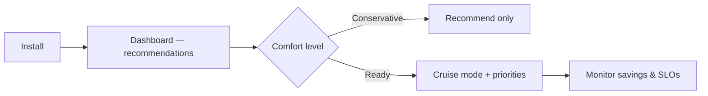

# Meet CruiseKube

**CruiseKube** is a Kubernetes controller which recommends optimized CPU and memory for workloads. It watches real behavior, learns stable demand and spikes, and applies **in-place** request updates so you stop paying for guesses, without giving up the guardrails that keep services reliable.

  

    

      📡
      <h3 class="ck-control-loop__title">Observe</h3>
      
Prometheus: live + historical metrics.

    

    →
    

      🧠
      <h3 class="ck-control-loop__title">Learn</h3>
      
Patterns and workload behavior.

    

    →
    

      💡
      <h3 class="ck-control-loop__title">Recommend</h3>
      
CPU &amp; memory request targets.

    

    →
    

      ✅
      <h3 class="ck-control-loop__title">Apply</h3>
      
Admission + runtime, safely.

    

    →
    

      🔁
      <h3 class="ck-control-loop__title">Re-observe</h3>
      
Keep adapting as things change.

    

  

  

# How it works

CruiseKube **observes** the cluster (Prometheus and the Kubernetes API), **derives** CPU and memory targets, and **applies** them at **admission** and **runtime** (in-place resize where the cluster supports it). The diagram below is a high-level map of how those pieces connect.

For components, background tasks, and control flows in detail, see **[Architecture](../documentation/concepts/arch-introduction.md)** in **Concepts**.

  

# Why Kubernetes Clusters Stay Expensive

Kubernetes gives you bin-packing (cluster autoscaler, Karpenter, etc.), but **waste often lives at the pod**: identical templates, peak-sized requests, and limits that throttle or kill at the wrong time. CruiseKube closes the loop **per pod, on the node where it actually runs**.

If you have ever bumped requests "just to be safe" run fat nodes because of a few noisy neighbors, or asked a team to manually tune YAML every quarter, CruiseKube is aimed at you.

- 🗄️ __Over-provisioning__

    Padded requests to dodge **throttling and OOM** → wasted capacity.

- 🛡️ __Operational lag__

    **YAML** tweaks by hand, rarely in step with real usage.

- ⚖️ __Inefficient scaling__

    High requests strand **node capacity**; autoscalers follow the wrong signals.

  

# What CruiseKube does differently

| You get | Why it matters |
|--------|----------------|
| **Admission-time sizing** | New pods start closer to reality before the scheduler commits capacity. |
| **Continuous runtime optimization** | Running pods are adjusted on a schedule—**no rolling restart** for request changes where the cluster supports in-place resize. |
| **Node-aware headroom sharing** | Spike capacity is **shared across pods on a node**, instead of every pod reserving its own private peak. |
| **PSI-informed CPU** | CPU decisions can incorporate **pressure / contention** signals—not just raw usage averages. |
| **Memory with a safety story** | Requests converge toward steady demand; **limits** retain headroom; **OOM handling** feeds learning back into the next admission pass. |
| **Explicit priorities** | When the math does not fit, **eviction order** follows policies you set—not random chaos. |

For a line-by-line comparison to Vertical Pod Autoscaler, see [CruiseKube vs VPA](comp-vs-vpa.md).

  

# Safe adoption path

CruiseKube is built for **progressive trust**:

1. **Install** with Helm, wire **Prometheus** and **PostgreSQL** (or use the bundled chart options).  
2. **Explore** recommendations in the dashboard—workloads start in **Recommend** (observe-only) until you opt in; see [Installation](../install/gs-installation.md) and [Policies & modes](../documentation/operate/operate-policies.md).  
3. **Enable Cruise mode** per workload when you are ready for applied changes.  
4. **Tune priorities and pricing** so cost views and eviction behavior match your risk model—[Resource pricing](../documentation/operate/operate-resource-pricing.md) and [Tradeoffs](../documentation/concepts/arch-tradeoffs.md).

