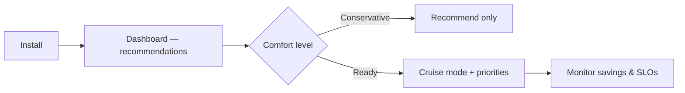

# Meet CruiseKube

**CruiseKube** is a Kubernetes controller which recommends optimized CPU and memory for workloads. It watches real behavior, learns stable demand and spikes, and applies **in-place** request updates so you stop paying for guesses, without giving up the guardrails that keep services reliable.

  

    

      📡
      <h3 class="ck-control-loop__title">Observe</h3>
      
Prometheus: live + historical metrics.

    

    →
    

      🧠
      <h3 class="ck-control-loop__title">Learn</h3>
      
Patterns and workload behavior.

    

    →
    

      💡
      <h3 class="ck-control-loop__title">Recommend</h3>
      
CPU &amp; memory request targets.

    

    →
    

      ✅
      <h3 class="ck-control-loop__title">Apply</h3>
      
Admission + runtime, safely.

    

    →
    

      🔁
      <h3 class="ck-control-loop__title">Re-observe</h3>
      
Keep adapting as things change.

    

  

---

## How it works

CruiseKube **observes** the cluster (Prometheus and the Kubernetes API), **derives** CPU and memory targets, and **applies** them at **admission** and **runtime** (in-place resize where the cluster supports it). The diagram below is a high-level map of how those pieces connect.

For components, background tasks, and control flows in detail, see **[Architecture](../concepts/arch-introduction.md)** in **Concepts**.

## Problem: Why Kubernetes Clusters Stay Expensive

Kubernetes gives you bin-packing (cluster autoscaler, Karpenter, etc.), but **waste often lives at the pod**: identical templates, peak-sized requests, and limits that throttle or kill at the wrong time. CruiseKube closes the loop **per pod, on the node where it actually runs**.

If you have ever bumped requests "just to be safe" run fat nodes because of a few noisy neighbors, or asked a team to manually tune YAML every quarter, CruiseKube is aimed at you.

  

    
🗄️

    <h3>Over-provisioning</h3>
    
Padded requests to dodge <strong>throttling and OOM</strong> → wasted capacity.

  

  

    
🛡️

    <h3>Operational lag</h3>
    
<strong>YAML</strong> tweaks by hand, rarely in step with real usage.

  

  

    
⚖️

    <h3>Inefficient scaling</h3>
    
High requests strand <strong>node capacity</strong>; autoscalers follow the wrong signals.

  

---

## What CruiseKube does differently

| You get | Why it matters |
|--------|----------------|
| **Admission-time sizing** | New pods start closer to reality before the scheduler commits capacity. |
| **Continuous runtime optimization** | Running pods are adjusted on a schedule—**no rolling restart** for request changes where the cluster supports in-place resize. |
| **Node-aware headroom sharing** | Spike capacity is **shared across pods on a node**, instead of every pod reserving its own private peak. |
| **PSI-informed CPU** | CPU decisions can incorporate **pressure / contention** signals—not just raw usage averages. |
| **Memory with a safety story** | Requests converge toward steady demand; **limits** retain headroom; **OOM handling** feeds learning back into the next admission pass. |
| **Explicit priorities** | When the math does not fit, **eviction order** follows policies you set—not random chaos. |

For a line-by-line comparison to Vertical Pod Autoscaler, see [CruiseKube vs VPA](comp-vs-vpa.md).

---

## Safe adoption path

CruiseKube is built for **progressive trust**:

1. **Install** with Helm, wire **Prometheus** and **PostgreSQL** (or use the bundled chart options).  
2. **Explore** recommendations in the dashboard—workloads start in **Recommend** (observe-only) until you opt in; see [Installation](../install/gs-installation.md) and [Policies & modes](../operate/operate-policies.md).  
3. **Enable Cruise mode** per workload when you are ready for applied changes.  
4. **Tune priorities and pricing** so cost views and eviction behavior match your risk model—[Resource pricing](../operate/operate-resource-pricing.md) and [Tradeoffs](../concepts/arch-tradeoffs.md).

---

## Requirements in brief

- **Kubernetes 1.33+** (in-place pod resource updates are central to the design).  
- **Prometheus** with the metrics CruiseKube expects (see [Pre-requisites](../install/gs-prerequisites.md)).  
- **PostgreSQL** (managed by you or the subchart).

---

## Next steps

| Step | Page |
|------|------|
| Understand scenarios | [Use cases](overview-use-cases.md) |
| Compare to VPA | [CruiseKube vs VPA](comp-vs-vpa.md) |
| Common questions | [FAQ](overview-faq.md) |
| Install | [Pre-requisites](../install/gs-prerequisites.md) → [Installation](../install/gs-installation.md) |
| Day-2 operations | [Dashboard](../operate/config-dashboard.md), [Policies & Modes](../operate/operate-policies.md), [Troubleshooting](../operate/operate-troubleshooting.md) |
| Internals | [Architecture](../concepts/arch-introduction.md), [Algorithm](../concepts/arch-algorithm.md) |

---

## Community

- **GitHub:** [truefoundry/CruiseKube](https://github.com/truefoundry/CruiseKube)  
- **Discord:** [TrueFoundry community](https://discord.gg/Dqek4xJa3N)  
- **Artifact Hub:** [cruisekube Helm chart](https://artifacthub.io/packages/helm/cruisekube/cruisekube)

If CruiseKube fits your cluster, the fastest validation is a normal install, a week of metrics with workloads on **Recommend**, then a small pilot cohort on **Cruise**—then expand with confidence.
