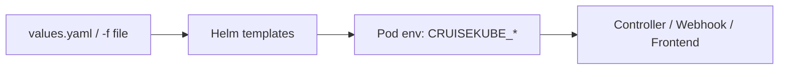

# Configuration

Production deployments configure CruiseKube through the **Helm chart**. Values set keys under `cruisekubeController.env` and `cruisekubeWebhook.env`, which map to the application’s **environment-variable config** (Viper-style `CRUISEKUBE_*` keys).

---

## Start here

1. **[Helm chart reference](reference-helm-chart.md)** — components, OCI coordinates, upgrade flow.  
2. **[charts/cruisekube/README.md](https://github.com/truefoundry/CruiseKube/blob/main/charts/cruisekube/README.md)** — full parameter matrix with defaults.  
3. **[values.yaml](https://github.com/truefoundry/CruiseKube/blob/main/charts/cruisekube/values.yaml)** — source of truth for your forked GitOps repo.

---

## Configuration surfaces

| Surface | Purpose |
|---------|---------|
| **Helm values** | Replicas, images, resources, ServiceMonitor, webhook certs, Postgres subchart. |
| **`cruisekubeController.env`** | Controller-only: Prometheus URL, task schedules, DB, server port, telemetry, recommendation task metadata. |
| **`cruisekubeWebhook.env`** | Webhook-only: memory toggles, stats API host, webhook-specific env from chart. |
| **`cruisekubeFrontend.*`** | UI image, `backendURL`, service ports. |
| **`global.postgresql.auth.*`** | External DB connection when `postgresql.enabled=false`. |

---

## Frequently adjusted environment keys

Exact names must match your chart version—verify in `values.yaml` on the tag you run.

| Concern | Representative env vars |
|---------|-------------------------|
| **Metrics provider** | Legacy Prometheus URL env vars (`CRUISEKUBE_DEPENDENCIES_INCLUSTER_PROMETHEUSURL`, `CRUISEKUBE_DEPENDENCIES_LOCAL_PROMETHEUSURL`) or structured provider env vars (`CRUISEKUBE_DEPENDENCIES_*_METRICSPROVIDER_*`). See [Prometheus metric requirements](prometheus-metrics.md) for required metric names, labels, and `job` values. |
| **Apply loop** | `CRUISEKUBE_CONTROLLER_TASKS_APPLYRECOMMENDATION_*` (enable, schedule, skip memory, metadata URLs) |
| **Stats** | `CRUISEKUBE_CONTROLLER_TASKS_CREATESTATS_*` |
| **Metrics export** | `CRUISEKUBE_CONTROLLER_TASKS_FETCHMETRICS_*` |
| **HTTP API** | `CRUISEKUBE_SERVER_PORT`, `CRUISEKUBE_SERVER_BASICAUTH_*` |
| **DB** | `CRUISEKUBE_DB_*` |
| **Recommendation policy** | `CRUISEKUBE_RECOMMENDATIONSETTINGS_*` (e.g. new workload threshold, OOM cooldown) |
| **Webhook** | Stats URL host mapping and webhook env from `values.yaml` |

Local development may use a **`config.local.yaml`** file instead—see [Dev environment](../contribute/dev-env.md).

---

## Metrics provider configuration

CruiseKube has exactly **one active metrics backend** at runtime. The active dependency block is selected by `controllerMode`:

| `controllerMode` | Active config block | Typical use |
|------------------|---------------------|-------------|
| `local` | `dependencies.local` | Developer machine using local kubeconfig and a port-forwarded Prometheus-compatible endpoint. |
| `in-cluster` | `dependencies.inCluster` | Helm/controller pod running inside Kubernetes. |

The legacy `prometheusURL` fields remain supported for backward compatibility. New installs can use the structured `metricsProvider` block when they need provider type, bearer-token, or provider-specific TLS settings.

### YAML fields and defaults

The same fields are available under both `dependencies.local.metricsProvider` and `dependencies.inCluster.metricsProvider`:

| YAML field | Default | Valid values / validation | Environment variable names |
|------------|---------|---------------------------|----------------------------|
| `type` | `""` (treated as `prometheus`) | `prometheus` or `kloudfuse`. Any other value fails config validation. | `CRUISEKUBE_DEPENDENCIES_LOCAL_METRICSPROVIDER_TYPE`, `CRUISEKUBE_DEPENDENCIES_INCLUSTER_METRICSPROVIDER_TYPE`. Local CLI/dev shorthand also supports `CRUISEKUBE_METRICS_PROVIDER`. |
| `url` | `""` | Required for structured providers. For `prometheus`, CruiseKube falls back to the legacy `prometheusURL` in the active block when `metricsProvider.url` is empty. For `kloudfuse`, set the Prometheus-compatible query base URL for the tenant/project CruiseKube should read. | `CRUISEKUBE_DEPENDENCIES_LOCAL_METRICSPROVIDER_URL`, `CRUISEKUBE_DEPENDENCIES_INCLUSTER_METRICSPROVIDER_URL`. Local CLI/dev shorthand also supports `CRUISEKUBE_METRICS_PROVIDER_URL`. |
| `bearerToken` | `""` | Required for `kloudfuse`; optional for `prometheus` endpoints that require bearer auth. Never commit real tokens to config files. | `CRUISEKUBE_DEPENDENCIES_LOCAL_METRICSPROVIDER_BEARERTOKEN`, `CRUISEKUBE_DEPENDENCIES_INCLUSTER_METRICSPROVIDER_BEARERTOKEN`. In Helm, prefer `cruisekubeController.metricsProvider.bearerTokenExistingSecret` so the pod env var is populated from an existing Secret. |
| `insecureSkipTLSVerify` | `false` | Set to `true` only for trusted/dev endpoints with self-signed certificates. Prefer correct CA trust in production. | `CRUISEKUBE_DEPENDENCIES_LOCAL_METRICSPROVIDER_INSECURESKIPTLSVERIFY`, `CRUISEKUBE_DEPENDENCIES_INCLUSTER_METRICSPROVIDER_INSECURESKIPTLSVERIFY`. Local CLI/dev shorthand also supports `CRUISEKUBE_METRICS_PROVIDER_INSECURE_SKIP_TLS_VERIFY`. |

Legacy Prometheus fields are still accepted:

| YAML field | Default | Environment variable names |
|------------|---------|----------------------------|
| `dependencies.local.prometheusURL` | `""` | `CRUISEKUBE_DEPENDENCIES_LOCAL_PROMETHEUSURL` |
| `dependencies.inCluster.prometheusURL` | `""` | `CRUISEKUBE_DEPENDENCIES_INCLUSTER_PROMETHEUSURL` |
| `dependencies.local.insecureSkipTLSVerify` | `false` | `CRUISEKUBE_DEPENDENCIES_LOCAL_INSECURESKIPTLSVERIFY` |
| `dependencies.inCluster.insecureSkipTLSVerify` | `false` | `CRUISEKUBE_DEPENDENCIES_INCLUSTER_INSECURESKIPTLSVERIFY` |

### Validation rules

- Only the dependency block selected by `controllerMode` is validated for controller runs.
- Empty `metricsProvider.type` is interpreted as `prometheus` for backward compatibility.
- `prometheus` requires either `metricsProvider.url` or the legacy active `prometheusURL`.
- `kloudfuse` requires both `metricsProvider.url` and `metricsProvider.bearerToken`.
- CruiseKube sends PromQL to the configured endpoint and expects Kubernetes metrics to remain Prometheus-compatible; it does not rewrite metric names, label names, or `job` labels per provider.

!!! warning "Keep bearer tokens out of inline config"
    Inline bearer tokens in YAML config files, CLI arguments, or Helm values can leak through Git history, shell history, process listings, rendered manifests, and support bundles. For local development, prefer environment variables such as `CRUISEKUBE_DEPENDENCIES_LOCAL_METRICSPROVIDER_BEARERTOKEN`. For production Helm installs, create a Kubernetes Secret ahead of time and set `cruisekubeController.metricsProvider.bearerTokenExistingSecret` plus `bearerTokenExistingSecretKey`.

---

## Operational policy (not Helm)

Per-workload **mode**, **priority**, and **resource pricing** in the UI are stored in the **application database** (and browser local storage for pricing)—see [Policies & modes](../operate/operate-policies.md) and [Resource pricing](../operate/operate-resource-pricing.md).

---

## Next steps

- [Installation](../../install/gs-installation.md)  
- [Dashboard](../operate/config-dashboard.md)  
- [Troubleshooting](../operate/operate-troubleshooting.md)
