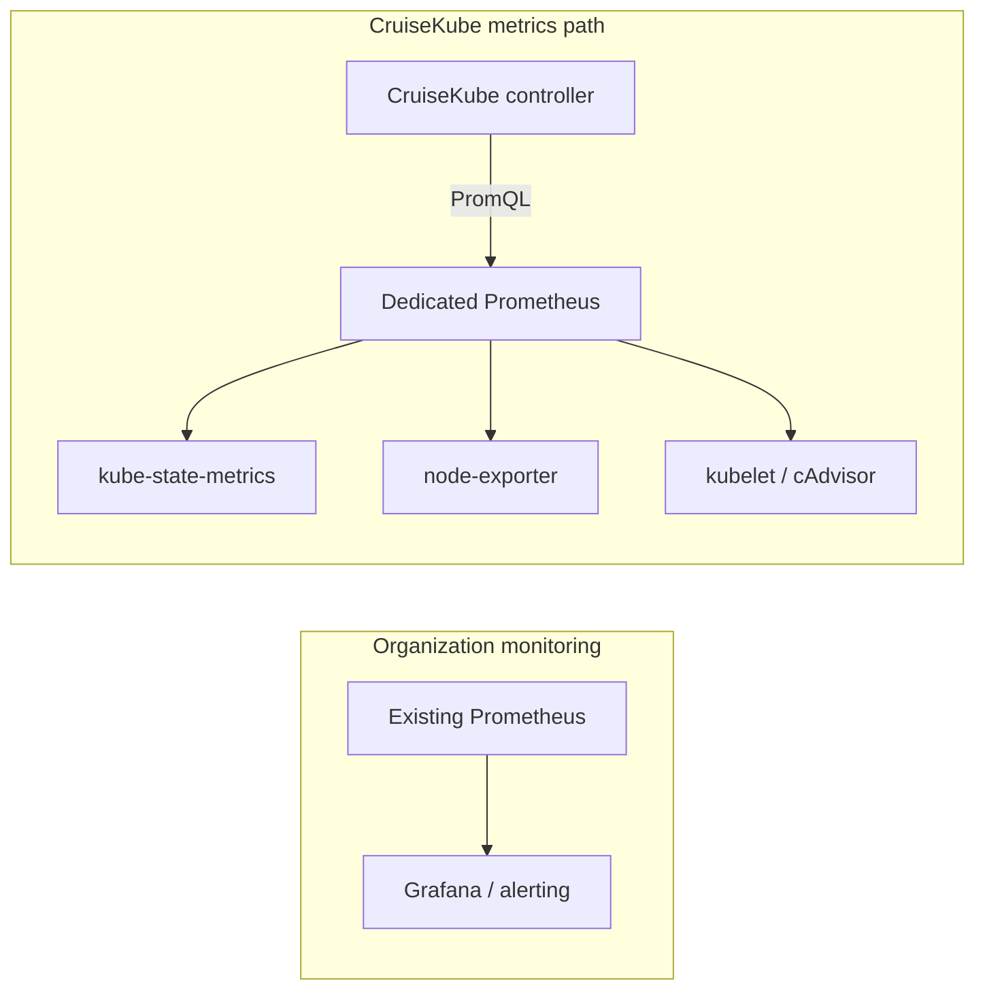

# Pre-requisites

Install these **before** [Installation](gs-installation.md). Missing any item usually shows up as empty recommendations, failing health checks, or webhook errors.


## Cluster and tooling

| Requirement | Notes |
|-------------|--------|
| **Kubernetes 1.33+** | In-place pod resource updates are part of the design; older versions are unsupported. PSI-aware optimization requires 1.34+; see Prometheus section below. |
| **kubectl** | Configured for the target cluster context. |
| **Helm 3** | For installing the official chart (OCI registry). |


## Prometheus

CruiseKube reads **container and node metrics** (usage, throttling, PSI where exposed, etc.) from **Prometheus**.

- Set `CRUISEKUBE_DEPENDENCIES_INCLUSTER_PROMETHEUSURL` (or equivalent) to a URL reachable **from the controller pods** (in-cluster Service URL, not `localhost`).
- CruiseKube expects standard metric names with `job="kube-state-metrics"`, `job="node-exporter"`, and kubelet/cAdvisor series. See [Troubleshooting — Prometheus metrics](../documentation/operate/operate-troubleshooting.md).

An existing Prometheus installation does **not** automatically mean it is compatible with CruiseKube. Before install, confirm your Prometheus retains the full set of raw Kubernetes metrics CruiseKube queries (see [Using a Dedicated Prometheus for CruiseKube](#using-a-dedicated-prometheus-for-cruisekube) if not).

### Option A — Use an existing compatible Prometheus (recommended when monitoring is already suitable)

If **kube-prometheus-stack** (or another Prometheus install) already runs in `monitoring` or elsewhere **and** exposes the required metrics without aggressive filtering:

1. Point the controller at the existing Prometheus Service URL, for example:
   `http://prometheus-kube-prometheus-prometheus.monitoring.svc:9090`
2. Ensure CruiseKube's ServiceMonitors are selected by that Prometheus (this chart labels them `release: prometheus` by default; widen `serviceMonitorSelector` on your Prometheus if needed).

You do **not** need a second Prometheus or a second node-exporter when the existing stack already stores the metrics CruiseKube needs.

### Option B — Greenfield (no monitoring stack yet)

If nothing monitors the cluster yet, install **kube-prometheus-stack** once as a standalone release (the CruiseKube chart does not bundle Prometheus):

```bash
helm repo add prometheus-community https://prometheus-community.github.io/helm-charts
helm repo update
helm install kube-prometheus-stack prometheus-community/kube-prometheus-stack \
  --namespace monitoring \
  --create-namespace \
  --set alertmanager.enabled=false \
  --set grafana.enabled=false \
  --set prometheus.prometheusSpec.serviceMonitorSelectorNilUsesHelmValues=false
```

Then set `cruisekubeController.env.CRUISEKUBE_DEPENDENCIES_INCLUSTER_PROMETHEUSURL` to that Prometheus in-cluster Service URL when you install CruiseKube.

!!! tip "Retention and storage"
    CruiseKube needs enough **retention** and **history** to produce good recommendations. For production, configure persistent storage and a retention window that matches your recommendation lookback (for example 15–30 days) on the Prometheus you point CruiseKube at.

## Using a Dedicated Prometheus for CruiseKube

Some organizations already run Prometheus, but that instance may **not** be suitable for CruiseKube even though it is healthy for alerting and dashboards. Common reasons:

| Issue | Why CruiseKube suffers |
|-------|-------------------------|
| **Metric relabeling at ingest** | Required series are dropped or renamed before they reach the query API. |
| **Recording rules** | Raw kubelet or cAdvisor metrics are replaced by aggregates CruiseKube does not query. |
| **Remote-write pipelines** | Metrics are forwarded to long-term storage with only a subset retained locally. |
| **Partial retention** | Only a fraction of Kubernetes metrics is kept to control cost. |
| **Disabled scrape jobs** | kubelet, kube-state-metrics, or node-exporter targets are not scraped. |
| **Short retention** | Data ages out before CruiseKube's lookback windows can use it. |

In these cases CruiseKube may produce **no recommendations**, **incomplete recommendations**, or fail health checks that depend on specific PromQL series. Symptoms often look like a broken install when the real problem is missing metrics — see [Troubleshooting — Prometheus metrics](../documentation/operate/operate-troubleshooting.md).

**You do not need to replace your existing monitoring stack.** Deploy a **second Prometheus** used only by CruiseKube. It can run alongside an existing kube-prometheus-stack (or any other monitoring system) in a separate namespace without interfering with production alerting.

### What the dedicated Prometheus should do

Configure the dedicated instance to:

- **Scrape** kube-state-metrics, node-exporter, and kubelet (cAdvisor) with standard job names.
- **Store raw metrics** without aggressive metric relabel drops, recording-rule substitution of required series, or cost-driven sampling of Kubernetes object metrics.
- **Retain history** long enough for CruiseKube's recommendation windows (plan for at least ~15 days unless you tune CruiseKube's schedules accordingly).
- **Expose** an in-cluster HTTP API (`/api/v1/query`, `/api/v1/query_range`) reachable from CruiseKube controller pods.

Point CruiseKube at this instance:

```yaml
cruisekubeController:
  env:
    CRUISEKUBE_DEPENDENCIES_INCLUSTER_PROMETHEUSURL: "http://cruisekube-prometheus.cruisekube-system.svc:9090"
```

(Replace the Service name and namespace with your deployment.)

### Deployment recommendation

Prefer a **lightweight standalone Prometheus** (single Deployment or StatefulSet with a static `prometheus.yml`, or the official Prometheus Helm chart) over a **second full kube-prometheus-stack** unless you specifically need the Prometheus Operator, CRDs, and ServiceMonitor-based discovery.

A standalone Prometheus is usually simpler because it:

- Avoids ServiceMonitor and PodMonitor selector complexity.
- Avoids running a second Prometheus Operator (and operator namespace scoping conflicts).
- Uses fewer cluster resources.
- Is easier to operate and troubleshoot when validating missing metrics.

Install kube-prometheus-stack as a **standalone** release only when you want Operator-managed scrape config and already run that pattern elsewhere — still use a **separate** release/namespace from production monitoring, and point CruiseKube only at the dedicated instance URL.

### Example architecture

Your production monitoring stack and CruiseKube's metrics path stay independent:



In words: **CruiseKube → dedicated Prometheus → (kube-state-metrics, node-exporter, kubelet)** while the organization's existing Prometheus continues to serve dashboards and alerts unchanged.

!!! note "Reusing exporters"
    You often **reuse** the cluster's existing node-exporter DaemonSet (only one can bind host port 9100 per node) and point the dedicated Prometheus at those targets. kube-state-metrics can be scraped from an existing Deployment or deployed alongside the dedicated Prometheus if your org policy requires isolation.

### Conflicts to avoid

| Situation | Symptom | What to do |
|-----------|---------|------------|
| Second **node-exporter** DaemonSet | Pod pending / *free ports* on host 9100 | Reuse the existing DaemonSet; scrape it from the dedicated Prometheus. |
| Controller cannot reach Prometheus | Empty stats / health check failures | Use an in-cluster `http://…svc:9090` URL, not `localhost`. |
| Production Prometheus missing series | Empty or partial recommendations | Use a [dedicated Prometheus](#using-a-dedicated-prometheus-for-cruisekube); do not assume `up==1` means CruiseKube metrics exist. |

**PSI (Pressure Stall Indicator):** CruiseKube's algorithm is built around **PSI-aware CPU** reasoning on clusters that expose the right metrics (Kubernetes 1.34+ PSI story). If PSI is absent, behavior degrades toward usage-only signals—still useful, but not identical to a full PSI deployment. See [Algorithm](../documentation/concepts/arch-algorithm.md).


## PostgreSQL

CruiseKube persists **workload statistics**, **recommendations**, and **per-workload overrides** in a database.

- **Option A:** **Bitnami PostgreSQL subchart** official Helm chart (`postgresql.enabled=true`), is enabled by default.
- **Option B:** Use your own Postgres and set `global.postgresql.auth.*` (host, port, user, password, database) per [Helm chart reference](../documentation/reference/reference-helm-chart.md).


## Network and RBAC

- Controller and webhook must reach **kube-apiserver**, **Prometheus**, and **PostgreSQL**.  
- The chart installs **RBAC** and **MutatingWebhookConfiguration** resources; ensure your GitOps / policy engines allow them.


## What you do *not* need (for a minimal install)

- Grafana (optional for you; not required by CruiseKube).  
- A separate metrics long-term store (CruiseKube queries Prometheus directly).
