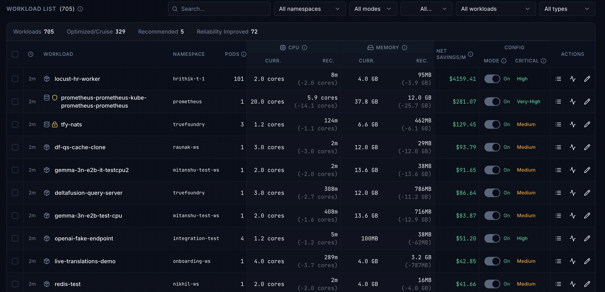
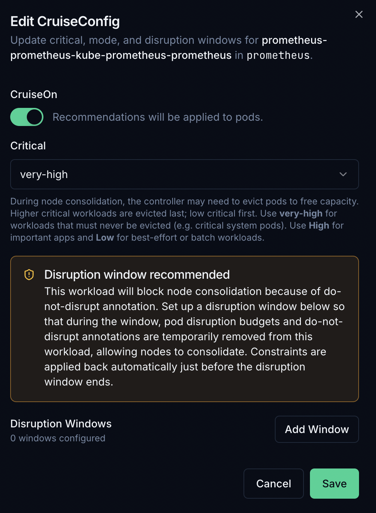

# Configuration Dashboard

The CruiseKube dashboard provides a web interface for monitoring and managing your resource optimization settings.

## Accessing the Dashboard

The dashboard is exposed as a Kubernetes Service and can be accessed in several ways:

### **Using kubectl port-forward**
```bash
kubectl port-forward -n cruisekube-system svc/cruisekube-frontend 3000:3000
```

### **Using ingress (if configured)**
If you have configured an ingress controller and exposed the dashboard via ingress, you can access it using the configured domain.

## Workloads & recommendations

The **Workloads** view shows cluster-wide cost estimates, CPU/memory allocatable vs requested vs utilised, and a searchable workload table (current vs recommended resources, possible savings, and per-workload **mode**).



## Policies & configuration

Open **Policies & Configuration** in the sidebar to manage **CruiseKube mode & priority** per workload (and other policy tabs such as Prometheus-related settings where available).



## Per-workload mode and priority

Each workload uses a **Recommend** / **Cruise** toggle and a **priority** dropdown:

1. **Recommend** — CruiseKube **computes** recommendations and shows them in the UI; it does **not** apply in-place resource changes for that workload.
2. **Cruise** — CruiseKube **applies** optimizations for that workload according to controller schedules and safety rules.
3. **Priority** — Controls eviction ordering when a node cannot fit the optimized set (low → evicted first; **No-eviction** never evicted for optimization). Single-replica and StatefulSet workloads often default to safer tiers—see [Policies & modes](dev-cost.md).


Roll out conservatively by leaving workloads on **Recommend** until you validate recommendations, then switch critical cohorts to **Cruise**—see [Installation](gs-installation.md) and [Policies & modes](dev-cost.md).
