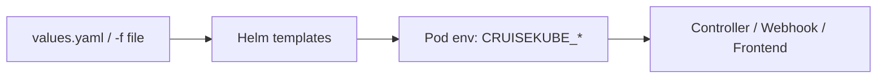

# Configuration

Production deployments configure CruiseKube through the **Helm chart**. Values set keys under `cruisekubeController.env` and `cruisekubeWebhook.env`, which map to the application’s **environment-variable config** (Viper-style `CRUISEKUBE_*` keys).

---

## Start here

1. **[Helm chart reference](reference-helm-chart.md)** — components, OCI coordinates, upgrade flow.  
2. **[charts/cruisekube/README.md](https://github.com/truefoundry/CruiseKube/blob/main/charts/cruisekube/README.md)** — full parameter matrix with defaults.  
3. **[values.yaml](https://github.com/truefoundry/CruiseKube/blob/main/charts/cruisekube/values.yaml)** — source of truth for your forked GitOps repo.

---

## Configuration surfaces

| Surface | Purpose |
|---------|---------|
| **Helm values** | Replicas, images, resources, ServiceMonitor, webhook certs, Postgres subchart. |
| **`cruisekubeController.env`** | Controller-only: Prometheus URL, task schedules, DB, server port, telemetry, recommendation task metadata. |
| **`cruisekubeWebhook.env`** | Webhook-only: memory toggles, stats API host, webhook-specific env from chart. |
| **`cruisekubeFrontend.*`** | UI image, `backendURL`, service ports. |
| **`global.postgresql.auth.*`** | External DB connection when `postgresql.enabled=false`. |

---

## Frequently adjusted environment keys

Exact names must match your chart version—verify in `values.yaml` on the tag you run.

| Concern | Representative env vars |
|---------|-------------------------|
| **Prometheus** | `CRUISEKUBE_DEPENDENCIES_INCLUSTER_PROMETHEUSURL`, `CRUISEKUBE_DEPENDENCIES_INCLUSTER_INSECURESKIPTLSVERIFY` |
| **Apply loop** | `CRUISEKUBE_CONTROLLER_TASKS_APPLYRECOMMENDATION_*` (enable, schedule, skip memory, metadata URLs) |
| **Stats** | `CRUISEKUBE_CONTROLLER_TASKS_CREATESTATS_*` |
| **Metrics export** | `CRUISEKUBE_CONTROLLER_TASKS_FETCHMETRICS_*` |
| **HTTP API** | `CRUISEKUBE_SERVER_PORT`, `CRUISEKUBE_SERVER_BASICAUTH_*` |
| **DB** | `CRUISEKUBE_DB_*` |
| **Recommendation policy** | `CRUISEKUBE_RECOMMENDATIONSETTINGS_*` (e.g. new workload threshold, OOM cooldown) |
| **Webhook** | Stats URL host mapping and webhook env from `values.yaml` |

Local development may use a **`config.local.yaml`** file instead—see [Dev environment](dev-env.md).

---

## Operational policy (not Helm)

Per-workload **mode**, **priority**, and **resource pricing** in the UI are stored in the **application database** (and browser local storage for pricing)—see [Policies & modes](operate-policies.md) and [Resource pricing](operate-resource-pricing.md).

---

## Next steps

- [Installation](gs-installation.md)  
- [Dashboard](config-dashboard.md)  
- [Troubleshooting](operate-troubleshooting.md)
