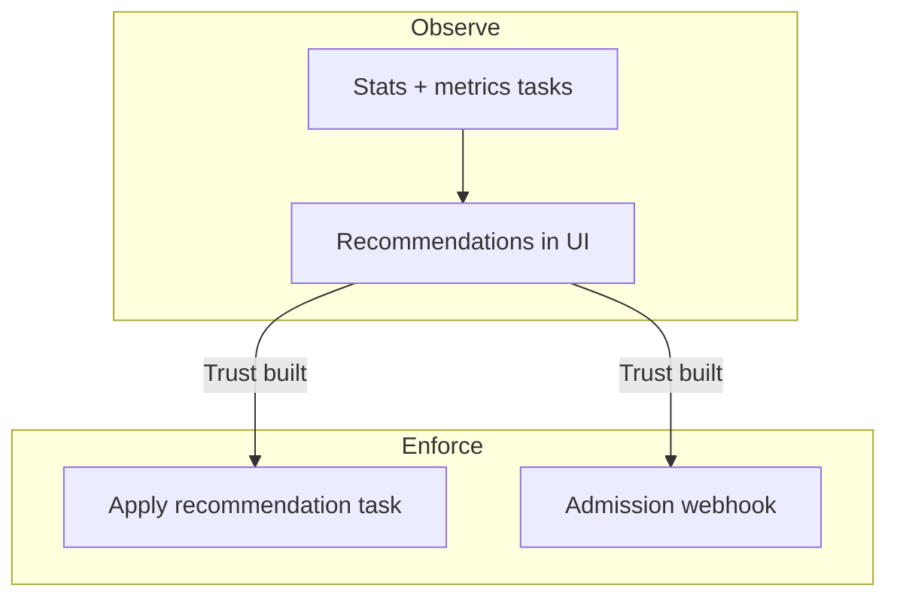

# Policies & modes

CruiseKube separates **observation** from **enforcement**. The dashboard is where most teams set **mode**, **eviction priority**, and related per-workload behavior (see also [Dashboard](config-dashboard.md)).

---

## Optimization modes

| Mode | Behavior (intent) |
|------|-------------------|
| **Recommend** (*disabled* in the UI wording) | CruiseKube **computes** guidance but does **not** apply changes that resize workloads. Use for shadowing and trust building. |
| **Cruise** (*enabled*) | CruiseKube **applies** recommendations according to cluster settings, schedules, and safety checks. |

!!! tip "Suggested media"
    **GIF** toggling a workload between modes with the confirmation or state chip visible—anchors the mental model for new users.

Exact UI labels evolve; always match what you see in your deployed frontend version.

---

## Dry-run vs live application

Helm values map to **controller** and **webhook** environment variables. Typical production rollouts:

1. Leave **dry-run** enabled initially so the system **records stats** and surfaces recommendations.  
2. Disable dry-run for **controller apply** and **webhook mutation** when ready—see [Installation — disable dry-run](gs-installation.md#apply-recommendations-disable-dry-run).

**Memory application** can be gated separately (`CRUISEKUBE_RECOMMENDATIONSETTINGS_DISABLEMEMORYAPPLICATION` and related flags)—useful if you want CPU-only automation first.

---

## Eviction priority (when the math does not fit)

On a crowded node, the runtime optimizer may need to **evict** lower-priority pods so the remaining set can be sized safely. Ordering is documented in depth under [Eviction priority](arch-algorithm.md#eviction-priority); summary:

| Level | Typical use |
|-------|-------------|
| **Low** | Default for many stateless replicas—evicted first. |
| **Medium** | Default bias for **single-replica** or **StatefulSet** workloads. |
| **High** | Evicted only when necessary after lower tiers. |
| **No-eviction** | Never evicted by CruiseKube for optimization pressure. |
| **DaemonSets** | Always protected. |

Pair this with your **PDBs** and **SLOs**—CruiseKube does not replace Kubernetes disruption controls.

---

## Namespace and workload exclusions

The Helm chart supports **webhook namespace exclusions** (e.g. system namespaces). Workloads can also be **disabled** via overrides / annotations depending on version—validate in your cluster if recommendations never appear for a subset of pods.

---

## Disruption windows and operational tasks

Releases have introduced **disruption windows** and related controller tasks so optimization can respect **maintenance hours**. If your version includes these APIs, treat them as the bridge between **aggressive savings** and **change risk**. Details live in release notes and values—search `DISRUPTION` / `disruption` in [`values.yaml`](https://github.com/truefoundry/CruiseKube/blob/main/charts/cruisekube/values.yaml).

---

## Cost views vs policy

**Policies & modes** control **whether and how** resources change. **Dollar estimates** use separate **unit pricing** assumptions—see [Resource pricing](operate-resource-pricing.md).

---

## Next steps

- [Dashboard walkthrough](config-dashboard.md)  
- [Algorithm — eviction & headroom](arch-algorithm.md)  
- [Tradeoffs](arch-tradeoffs.md)  
- [Troubleshooting](operate-troubleshooting.md)
