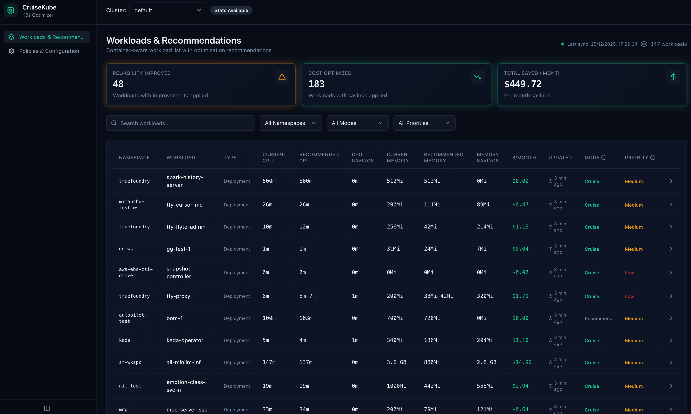

# Setup

Get started by following below steps:

## Prerequisites

- **Kubernetes Cluster:** You should have a running Kubernetes cluster with at least Kubernetes 1.33. You can use any cloud-based or on-premises Kubernetes distribution.
- **kubectl:** Installed and configured to interact with your Kubernetes cluster.
- **Helm:** Installed for managing Kubernetes applications.
- **Postgresql:** We require a postgresql database, you can pass your own, or enable it in CruiseKube helm chart, for CruiseKube-managed postgresql.
- **Prometheus:** You should have a prometheus installed in your cluster.
??? example "Installing Prometheus"
    We can setup a Prometheus instance if not already present.
    
    Please note, if a instance is already installed, new installation might fail. You can pass the existing Prometheus instance when installing CruiseKube.

    ```bash
    helm repo add prometheus-community https://prometheus-community.github.io/helm-charts
    helm repo update
    helm install kube-prometheus-stack prometheus-community/kube-prometheus-stack \
      --namespace monitoring \
      --create-namespace \
      --set alertmanager.enabled=false \
      --set grafana.enabled=false \
      --set prometheus.prometheusSpec.serviceMonitorSelectorNilUsesHelmValues=false
    ```

## Install

### **1. Install CruiseKube using helm**

Install CruiseKube from the OCI registry:

```bash
helm install cruisekube oci://tfy.jfrog.io/tfy-helm/cruisekube --namespace cruisekube-system --create-namespace \
  --set cruisekubeController.env.CRUISEKUBE_DEPENDENCIES_INCLUSTER_PROMETHEUSURL="http://prometheus-kube-prometheus-prometheus.monitoring.svc:9090" \
  --set postgresql.enabled=true \
```

- Pass your own prometheus URL if using an existing installation.
- If you want to use your own postgresql set `postgresql.enabled` to false, and pass the value in the global section of [values.yaml](https://github.com/truefoundry/CruiseKube/blob/main/charts/cruisekube/values.yaml#L3)

> **Note:** You can customize the installation by providing your own `values.yaml` file with specific configurations. See the [configuration documentation](config.md) for available options.

</br>

### **2. Verify Installation**

Check that the CruiseKube components are running:

```bash
kubectl get pods -n cruisekube-system
```

You should see pods like `cruisekube-controller-manager-xxx` and `cruisekube-webhook-server-xxx` in the `Running` state.

</br>

### **3. View Recommendations**

Once the tasks are enabled, you can view the recommendations generated by Port-Forwarding the frontend service.

```bash
kubectl port-forward -n cruisekube-system svc/cruisekube-frontend 3000:3000
```

Open your browser and navigate to `http://localhost:3000` to view the recommendations.



Read more about configuration in the [Configuration Dashboard](config-dashboard.md) section.

</br>

### **4. Apply Recommendations**

CruiseKube now applies supported recommendations directly. If you want memory changes enabled as well, set the memory application flags to `false`.

Following flags need to be set to enable memory application completely.

  - cruisekubeController.env.CRUISEKUBE_RECOMMENDATIONSETTINGS_DISABLEMEMORYAPPLICATION=false
  - cruisekubeWebhook.env.CRUISEKUBE_RECOMMENDATIONSETTINGS_DISABLEMEMORYAPPLICATION=false

```bash
helm upgrade --install cruisekube oci://tfy.jfrog.io/tfy-helm/cruisekube --namespace cruisekube-system --create-namespace \
--set cruisekubeController.env.CRUISEKUBE_DEPENDENCIES_INCLUSTER_PROMETHEUSURL="http://prometheus-kube-prometheus-prometheus.monitoring.svc:9090" \
--set postgresql.enabled=true \
--set cruisekubeController.env.CRUISEKUBE_RECOMMENDATIONSETTINGS_DISABLEMEMORYAPPLICATION=false \
--set cruisekubeWebhook.env.CRUISEKUBE_RECOMMENDATIONSETTINGS_DISABLEMEMORYAPPLICATION=false
```

> You can check all the available environment variables in the [values.yaml file](https://github.com/truefoundry/CruiseKube/blob/main/charts/cruisekube/values.yaml#L88).

</br>


## Uninstall

To uninstall CruiseKube, run:

```bash
helm uninstall ck-demo -n cruisekube-system
kubectl delete namespace cruisekube-system
```
