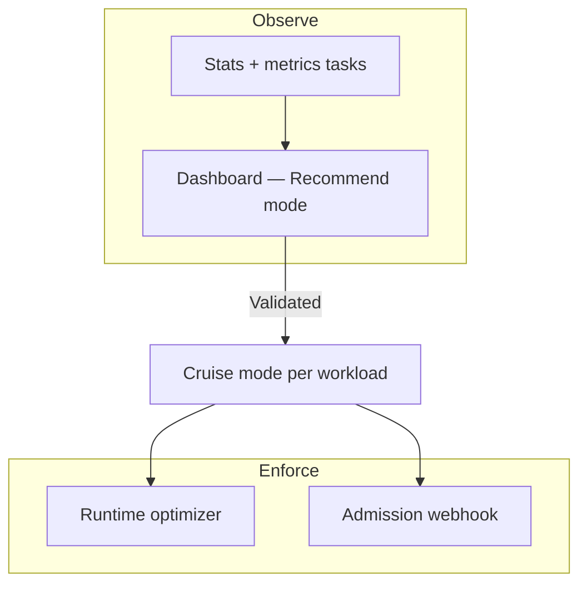
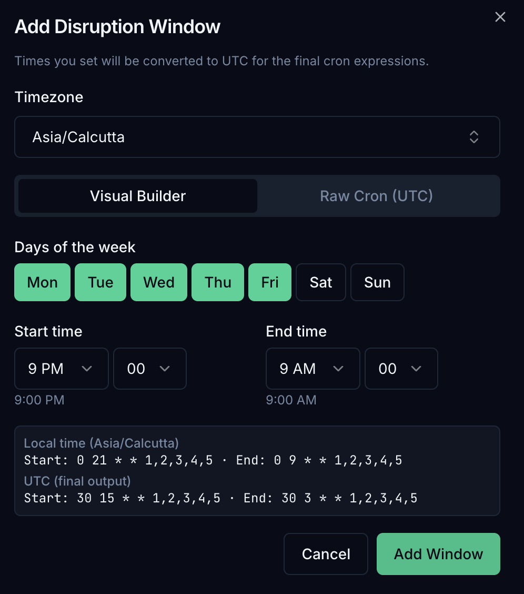

# Policies & modes

CruiseKube separates **observation** from **enforcement** using **per-workload** settings. The **Policies & Configuration** screen is where most teams set **mode**, **eviction priority**, and related behavior (see [Dashboard](config-dashboard.md)).

---

## Optimization modes

| Mode | Behavior (intent) |
|------|-------------------|
| **Recommend** | CruiseKube **computes** recommendations and shows them in the dashboard; it does **not** apply in-place resource changes for that workload. |
| **Cruise** | CruiseKube **applies** optimizations for that workload according to controller schedules, admission webhook behavior, and safety rules. |

!!! tip "Suggested media"
    Short **GIF** of the **Recommend** / **Cruise** toggle and priority dropdown on a single row—matches the current UI.

Exact labels can vary slightly by release; trust what you see in your deployed frontend.

---

## Rolling out changes safely

Typical progression:

1. **Install** and let **stats / metrics** tasks populate the database.  
2. Keep workloads on **Recommend** until recommendations look credible for your SLOs.  
3. Move cohorts to **Cruise** in stages (namespace-by-namespace or tier-by-tier).  

**Memory-specific behavior** can still be gated at deploy time with `CRUISEKUBE_RECOMMENDATIONSETTINGS_DISABLEMEMORYAPPLICATION` (controller and webhook) if you want CPU-only automation first—see [Configuration](config.md) and [`values.yaml`](https://github.com/truefoundry/CruiseKube/blob/main/charts/cruisekube/values.yaml).

---

## Eviction priority (when the math does not fit)

On a crowded node, the runtime optimizer may need to **evict** lower-priority pods so the remaining set can be sized safely. Ordering is documented in depth under [Eviction priority](arch-algorithm.md#eviction-priority); summary:

| Level | Typical use |
|-------|-------------|
| **Low** | Default for many stateless replicas—evicted first. |
| **Medium** | Default bias for **single-replica** or **StatefulSet** workloads. |
| **High** | Evicted only when necessary after lower tiers. |
| **No-eviction** | Never evicted by CruiseKube for optimization pressure. |
| **DaemonSets** | Always protected. |

Pair this with your **PDBs** and **SLOs**—CruiseKube does not replace Kubernetes disruption controls.

---

## Namespace and workload exclusions

The Helm chart supports **webhook namespace exclusions** (e.g. system namespaces). Workloads can also be **disabled** via overrides / annotations depending on version—validate in your cluster if recommendations never appear for a subset of pods.

---

## Disruption windows and operational tasks

Releases have introduced **disruption windows** and related controller tasks so optimization can respect **maintenance hours**. If your version includes these APIs, treat them as the bridge between **aggressive savings** and **change risk**. In the dashboard you can define windows with a visual builder (timezone, days, start/end time); schedules are stored as cron expressions, with local time summarized alongside the UTC values used by the controller.

Details also live in release notes and Helm values—search `DISRUPTION` / `disruption` in [`values.yaml`](https://github.com/truefoundry/CruiseKube/blob/main/charts/cruisekube/values.yaml).

---

## Cost views vs policy

**Policies & modes** control **whether and how** resources change. **Dollar estimates** use separate **unit pricing** assumptions—see [Resource pricing](operate-resource-pricing.md).

---

## Next steps

- [Dashboard walkthrough](config-dashboard.md)  
- [Algorithm — eviction & headroom](arch-algorithm.md)  
- [Tradeoffs](arch-tradeoffs.md)  
- [Troubleshooting](operate-troubleshooting.md)
