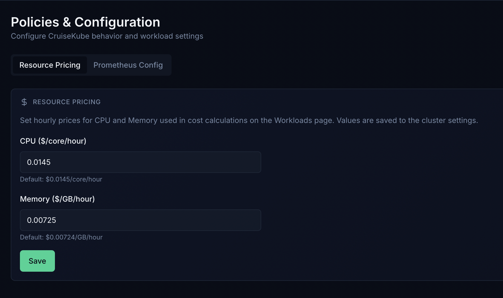

# Resource pricing

CruiseKube surfaces **approximate cost and savings** in the dashboard by applying **hourly unit rates** to CPU and memory. This is a **heuristic**, not billing integration.

!!! info "Beta"
    Cost monitoring is **beta**. CruiseKube does not maintain a full time-series billing history; figures are point-in-time estimates from current recommendations and requests.

---

## Mental model

In the real world you pay for **instances** (on-demand, spot, reserved, etc.). The dashboard instead uses:

- A configurable **$/CPU core / hour**  
- A configurable **$/GB memory / hour**  

All “monthly” numbers use **720 hours/month** unless noted otherwise in the product.

---

## Default assumptions (built-in reference model)

When no custom rates are set, calculations use a **reference** derived from public EC2 pricing:

- Base shape: **AWS `c5a.xlarge`** (4 vCPU, 8 GiB).  
- Blend: **half on-demand, half spot** (no reserved).  
- Split: **half** of instance $/hr attributed to **CPU**, **half** to **memory** (network/storage bundled for this model).  
- **GPU** instances are excluded from this reference path.

From [instances.vantage.sh — c5a.xlarge](https://instances.vantage.sh/aws/ec2/c5a.xlarge?currency=USD) (illustrative; prices change):

- Blended instance $/hr ≈ **($0.154 + $0.078) / 2** → **$0.116/hr**  
- Per vCPU before split: **$0.116 / 4** → **$0.029/core/hr**  
- Per GiB before split: **$0.116 / 8** → **$0.0145/GiB/hr**  
- After 50/50 CPU vs memory attribution on that synthetic split, effective defaults used in-product are approximately:

| Resource | Default (USD) |
|----------|----------------|
| **CPU** | **0.0145** / core / hour |
| **Memory** | **0.00724** / GiB / hour |

---

## Where to configure

1. Open the dashboard (see [Dashboard](config-dashboard.md)).  
2. In **Policies & Configuration**, open the **Resource pricing** (or equivalent) tab—CPU and memory unit rates used for dashboard cost cards and per-workload savings.  
3. Enter **CPU** and **memory** unit prices.  

Values are stored **in the browser** for the cost views (they are not a substitute for your cloud bill).

---

## Related reading

- **[Policies & modes](operate-policies.md)** — Recommend vs Cruise, eviction priority.  
- **[Tradeoffs](arch-tradeoffs.md)** — eviction, HPA interaction, memory risk.  
- **[Helm chart reference](reference-helm-chart.md)** — no direct “billing API”; pricing remains a UI concern.

---

## Honest limitations

- Does not know your **committed use**, **enterprise discounts**, or **regional** price tables.  
- Does not replace **cloud cost tools** (CUR, FinOps platforms).  
- **Savings** are “if recommendations were fully applied,” not a bankable invoice line.

Use the numbers for **directional** decisions and executive storytelling—then validate against your real CUR or billing export.
