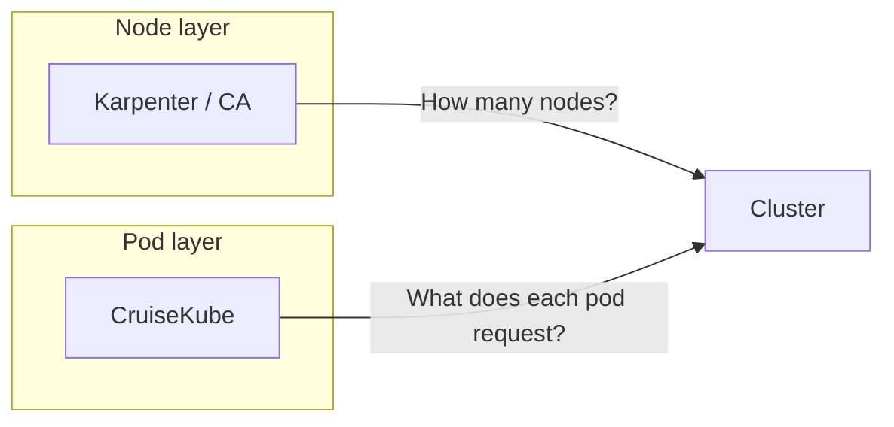

# Use cases

CruiseKube is not a replacement for **Horizontal Pod Autoscaler** (replica scaling) or **node provisioning** (Karpenter, Cluster Autoscaler). It owns the **vertical** question: *what should this pod request right now?* Below are patterns that map cleanly to that model.

---

## Platform engineering: default away from “peak YAML”

**Situation:** Dozens of teams copy-paste `500m` / `1Gi` into every Deployment because nobody wants to be paged for throttling or OOMs.

**What CruiseKube does:** Learns per-workload behavior, applies **steady demand + shared spike headroom** on each node, and exposes **per-workload policy** (recommend vs cruise, eviction priority) in the dashboard.

**Outcome:** Less spreadsheet-driven tuning, more consistent cluster utilization, fewer “mystery fat” requests.

!!! tip "Suggested media"
    **Before/after screenshot** of the dashboard summary: total requested CPU/memory vs recommended, or a single namespace view.

---

## FinOps and chargeback programs

**Situation:** Leadership wants **visibility into waste** and a credible **savings estimate**, not just node counts.

**What CruiseKube does:** Surfaces current vs recommended resources in the UI; **resource pricing** (configurable unit rates) turns deltas into approximate **$/month** views. See [Resource pricing](operate-resource-pricing.md) for assumptions and limitations.

**Outcome:** A shared artifact (the dashboard) aligns engineering and finance on “what we could save if we trusted the optimizer.”

---

## Mixed-criticality clusters

**Situation:** Batch jobs share nodes with latency-sensitive APIs. You need optimization **without** evicting the wrong tenant first.

**What CruiseKube does:** **Eviction ranking** and **no-eviction** classes steer who gives way when a node cannot satisfy the optimized set. DaemonSets are treated as immovable; StatefulSets and single-replica workloads get safer defaults.

**Outcome:** Optimization becomes a policy conversation, not roulette.

!!! tip "Suggested media"
    Short **GIF** of the workload policy panel: changing priority / mode for two workloads side by side.

---

## Admission safety net for bursty workloads

**Situation:** New pods are sized for “worst week last quarter” and immediately reserve half a node.

**What CruiseKube does:** The **mutating webhook** sets initial requests from **learned peaks and history** so scheduling starts from data, not folklore.

**Outcome:** New revisions land closer to reality before the continuous optimizer ever runs.

---

## Complementing cluster autoscalers

**Situation:** Karpenter keeps you at the right **node count**, but pods still **request** more than they use—so bins look full while metrics look idle.

**What CruiseKube does:** Shrinks **pod requests** so schedulers and autoscalers see **honest demand**, improving packing and often **delaying or avoiding** unnecessary scale-out.

**Outcome:** Cost wins at both **node** and **request** layers.

---

## Pilot-friendly rollout

**Situation:** You want proof on **one namespace** or **one service line** before global enforcement.

**What CruiseKube does:** Operate in **recommend-only** or **dry-run** modes, then enable **Cruise mode** selectively. See [Policies & Modes](dev-cost.md).

**Outcome:** Measurable signal (metrics + dashboard) before broad automation.

---

## When CruiseKube is a poor fit

- You rely on **CPU- or memory-based HPA** for the same workloads (CruiseKube skips them by design).  
- You need **JVM heap** to track container resize dynamically without process restart—support is limited today; see [FAQ](overview-faq.md).  
- You expect benefit **without** a working **Prometheus** and **autoscaler-capable** cluster topology—see [Tradeoffs](arch-tradeoffs.md).

For a capability comparison to VPA, read [CruiseKube vs VPA](comp-vs-vpa.md).
