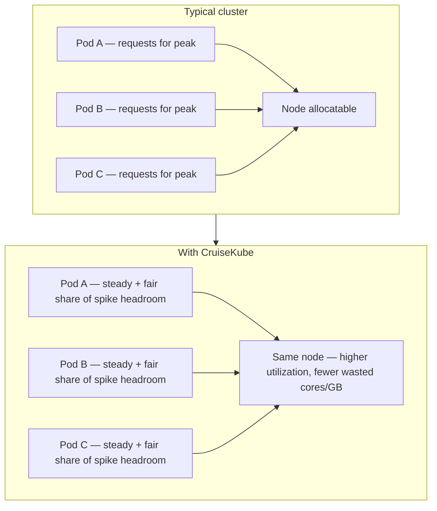
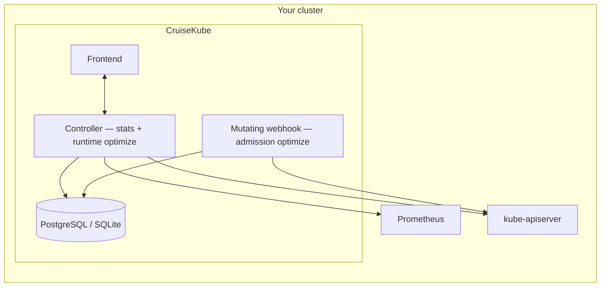
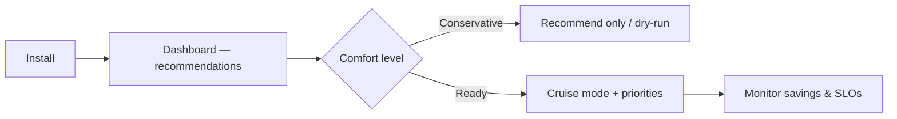

# Meet CruiseKube

**CruiseKube** is autopilot for how your workloads *ask* the cluster for CPU and memory. It watches real behavior, learns stable demand and spikes, and applies **in-place** request updates so you stop paying for guesses—without giving up the guardrails that keep services reliable.

If you have ever bumped requests “just to be safe,” run fat nodes because of a few noisy neighbors, or asked a team to manually tune YAML every quarter—CruiseKube is aimed at you.

!!! tip "Suggested media — hero loop"
    Add a **10–20s GIF or short video** that shows: the dashboard loading, a workload toggling from *Recommend* to *Cruise*, and a visible request/limit or savings line changing. Keep it subtle and readable at doc width (e.g. 1200px max).

---

## The problem in one diagram

Kubernetes gives you bin-packing (cluster autoscaler, Karpenter, etc.), but **waste often lives at the pod**: identical templates, peak-sized requests, and limits that throttle or kill at the wrong time. CruiseKube closes the loop **per pod, on the node where it actually runs**.

---

## What CruiseKube does differently

| You get | Why it matters |
|--------|----------------|
| **Admission-time sizing** | New pods start closer to reality before the scheduler commits capacity. |
| **Continuous runtime optimization** | Running pods are adjusted on a schedule—**no rolling restart** for request changes where the cluster supports in-place resize. |
| **Node-aware headroom sharing** | Spike capacity is **shared across pods on a node**, instead of every pod reserving its own private peak. |
| **PSI-informed CPU** | CPU decisions can incorporate **pressure / contention** signals—not just raw usage averages. |
| **Memory with a safety story** | Requests converge toward steady demand; **limits** retain headroom; **OOM handling** feeds learning back into the next admission pass. |
| **Explicit priorities** | When the math does not fit, **eviction order** follows policies you set—not random chaos. |

For a line-by-line comparison to Vertical Pod Autoscaler, see [CruiseKube vs VPA](comp-vs-vpa.md).

---

## How the pieces fit together

At a high level, CruiseKube is four cooperating surfaces: metrics and stats, a controller loop, an admission webhook, and a UI for humans.

Deeper detail, sequence diagrams, and OOM flows live under [Architecture](arch-introduction.md).

!!! tip "Suggested media — architecture"
    Optional **static diagram** (PNG/SVG) matching your internal slides: Controller, Webhook, DB, Prometheus, and API server with labeled arrows. Useful for executive summaries and onboarding decks.

---

## Who should adopt it

- **Platform / SRE teams** shrinking idle CPU and memory without owning every microservice’s tuning.
- **Engineering orgs** that want **defaults that improve over time** instead of static `resources:` blocks copied from templates.
- **Cost-conscious operators** already using node autoscalers but still seeing **low utilization of requested resources**.

Concrete scenarios are on [Use cases](overview-use-cases.md).

---

## Safe adoption path

CruiseKube is built for **progressive trust**:

1. **Install** with Helm, wire **Prometheus** and **PostgreSQL** (or use the bundled chart options).  
2. **Explore** recommendations in the dashboard—defaults skew toward **dry-run** and **observe-first** behavior; see [Installation](gs-installation.md) and [Policies & Modes](dev-cost.md).  
3. **Enable Cruise mode** per workload or namespace when you are ready for applied changes.  
4. **Tune priorities and pricing** so cost views and eviction behavior match your risk model—[Resource pricing](operate-resource-pricing.md) and [Tradeoffs](arch-tradeoffs.md).

!!! tip "Suggested media — product walkthrough"
    A **screen recording GIF** of: port-forward → login → open a workload → flip mode → show before/after request columns or savings panel.

---

## Requirements in brief

- **Kubernetes 1.33+** (in-place pod resource updates are central to the design).  
- **Prometheus** with the metrics CruiseKube expects (see [Pre-requisites](gs-prerequisites.md)).  
- **PostgreSQL** (managed by you or the subchart).

---

## Next steps

| Step | Page |
|------|------|
| Understand scenarios | [Use cases](overview-use-cases.md) |
| Compare to VPA | [CruiseKube vs VPA](comp-vs-vpa.md) |
| Common questions | [FAQ](overview-faq.md) |
| Install | [Pre-requisites](gs-prerequisites.md) → [Installation](gs-installation.md) |
| Day-2 operations | [Dashboard](config-dashboard.md), [Policies & Modes](dev-cost.md), [Troubleshooting](operate-troubleshooting.md) |
| Internals | [Architecture](arch-introduction.md), [Algorithm](arch-algorithm.md) |

---

## Community

- **GitHub:** [truefoundry/CruiseKube](https://github.com/truefoundry/CruiseKube)  
- **Discord:** [TrueFoundry community](https://discord.gg/Dqek4xJa3N)  
- **Artifact Hub:** [cruisekube Helm chart](https://artifacthub.io/packages/helm/cruisekube/cruisekube)

If CruiseKube fits your cluster, the fastest validation is an install in **dry-run**, a week of metrics, and a small pilot namespace in **Cruise mode**—then expand with confidence.
