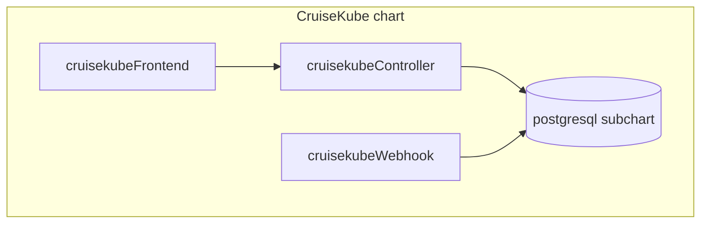

# Helm chart

CruiseKube ships as a **Helm chart** that installs the **controller**, **mutating webhook**, optional **frontend**, and optional **PostgreSQL**.

---

## Install coordinates

| Item | Value |
|------|--------|
| **OCI registry** | `oci://tfy.jfrog.io/tfy-helm/cruisekube` |
| **Source** | [`charts/cruisekube`](https://github.com/truefoundry/CruiseKube/tree/main/charts/cruisekube) in the Git repository |
| **Discovery** | [Artifact Hub — cruisekube](https://artifacthub.io/packages/helm/cruisekube/cruisekube) |

Minimal install (adjust Prometheus URL):

```bash
helm install cruisekube oci://tfy.jfrog.io/tfy-helm/cruisekube \
  --namespace cruisekube-system \
  --create-namespace \
  --set cruisekubeController.env.CRUISEKUBE_DEPENDENCIES_INCLUSTER_PROMETHEUSURL="http://YOUR_PROMETHEUS:9090" \
  --set postgresql.enabled=true
```

Step-by-step narrative: [Installation](gs-installation.md).

---

## Components



| Deployment | Role |
|------------|------|
| **Controller** | Scheduled tasks: stats, metrics export, apply recommendations, optional node load / cleanup / disruption tasks. |
| **Webhook** | Mutating admission: initial resource shaping on pod create. |
| **Frontend** | Dashboard UI; set `cruisekubeFrontend.backendURL` to the controller API Service URL. |
| **PostgreSQL** | Optional embedded database; disable and point `global.postgresql.auth.*` external when required. |

---

## Values you will touch first

| Area | Keys (examples) |
|------|-----------------|
| **Prometheus** | `cruisekubeController.env.CRUISEKUBE_DEPENDENCIES_INCLUSTER_PROMETHEUSURL` |
| **Who applies changes** | **Recommend** vs **Cruise** per workload in the dashboard ([Policies & modes](operate-policies.md)); advanced task env vars remain in `values.yaml` if you customize controller/webhook behavior. |
| **Memory apply** | `CRUISEKUBE_RECOMMENDATIONSETTINGS_DISABLEMEMORYAPPLICATION` (controller + webhook) |
| **Webhook → API** | `cruisekubeWebhook.webhook.statsURL.host` must reach the controller Service from webhook pods |
| **Frontend → API** | `cruisekubeFrontend.backendURL` |
| **Images** | `cruisekubeController.image.*`, `cruisekubeWebhook.image.*`, `cruisekubeFrontend.image.*` |
| **ServiceMonitor** | `*.serviceMonitor.enabled` for Prometheus Operator |

The authoritative table with defaults lives in **[charts/cruisekube/README.md](https://github.com/truefoundry/CruiseKube/blob/main/charts/cruisekube/README.md)** (generated from `values.yaml`).

---

## Upgrades

```bash
helm upgrade --install cruisekube oci://tfy.jfrog.io/tfy-helm/cruisekube \
  -n cruisekube-system \
  -f your-values.yaml
```

Always read **release notes** and migrate values when bumping **appVersion**—webhook ordering, new env vars, and task defaults change between minors.

---

## Uninstall

See [Installation — Uninstall](gs-installation.md#uninstall).

---

## Related docs

- [Configuration overview](config.md)  
- [Troubleshooting](operate-troubleshooting.md)  
- [Security reporting](dev-security.md)
